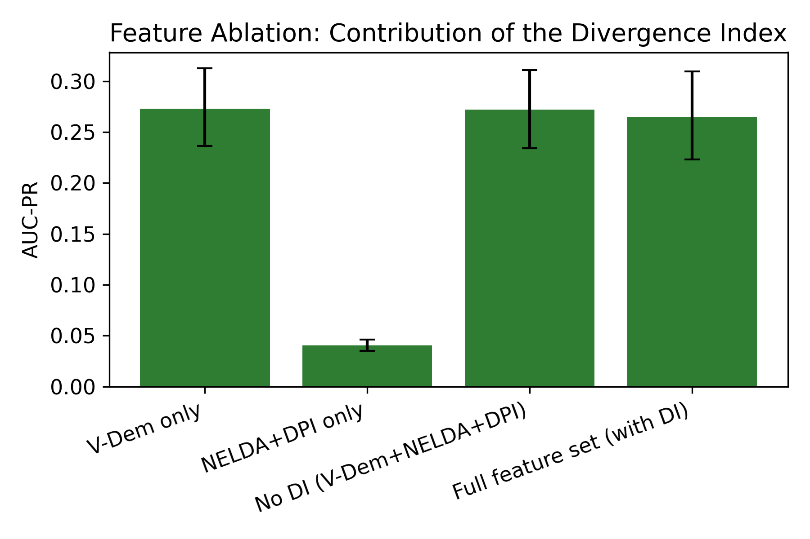
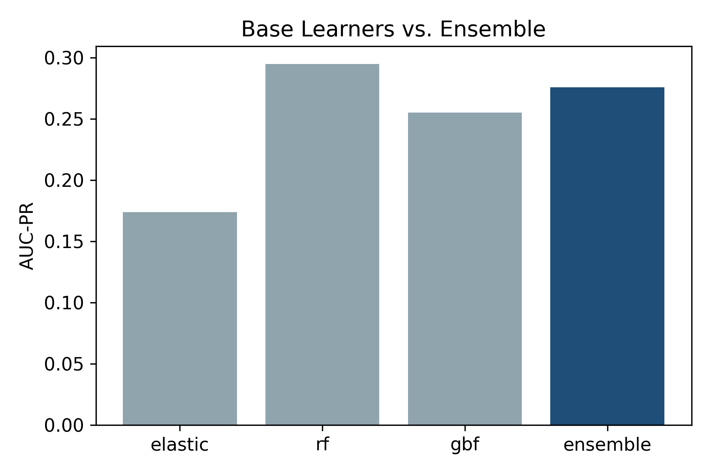
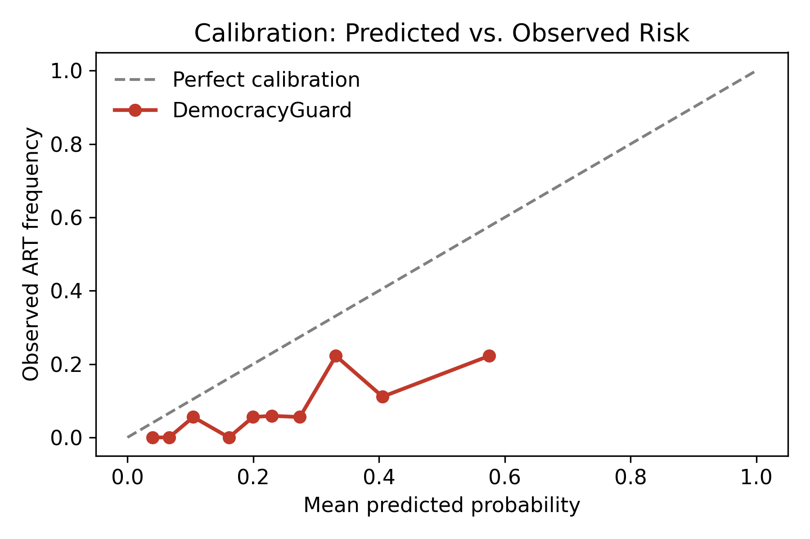
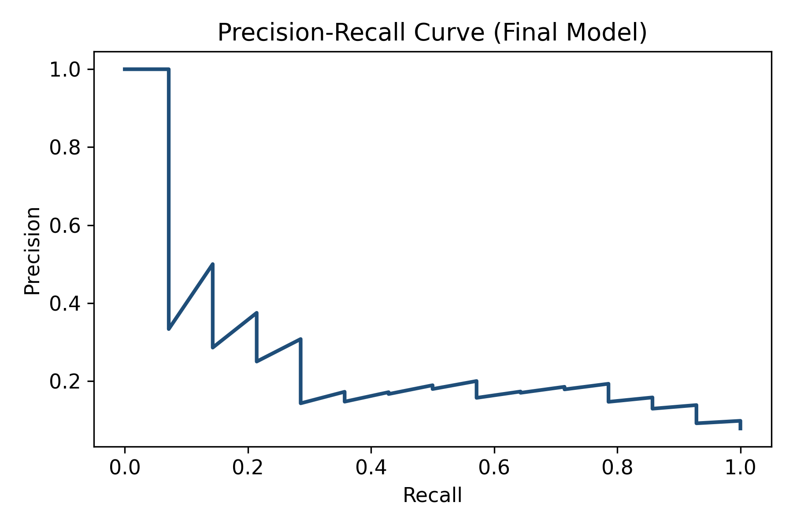

# 🏛️ DemocracyGuard

**An honest empirical test of subjective/objective reconciliation for forecasting democratic backsliding**

[](https://www.python.org/)
[](LICENSE)
[]()
[]()

---

## Overview

**DemocracyGuard** forecasts **Adverse Regime Transitions (ARTs)** — a country moving down the *Regimes of the World* classification within a two-year horizon — using an ensemble of elastic-net logistic regression, random forest, and gradient boosted trees trained on real V-Dem, NELDA, DPI, and CPJ country-year data.

This repository documents a **rigorous empirical test**, not a win-first pitch. We proposed three specific design choices — a Divergence Index reconciling subjective and objective democracy indicators, a 16–17 year sliding training window, and an unweighted ensemble — and tested each one directly. **None of the three were supported by the data.** We report exactly what we found, why, and what it means for future work.

> If you're looking for a paper that claims a clean win, this isn't it. If you're looking for a transparent, reproducible test of a well-motivated idea — including where it didn't pan out — that's exactly what's here.

---

## 📋 Table of Contents

- [Key Findings](#-key-findings)
- [Repository Structure](#-repository-structure)
- [Setup](#-setup)
- [Data Sources](#-data-sources)
- [Methodology](#-methodology)
- [Results](#-results)
- [Model Hyperparameters](#-model-hyperparameters)
- [Limitations](#-limitations)
- [Citation](#-citation)
- [About the Developer](#-about-the-developer)
- [License](#-license)

---

## 🔍 Key Findings

| Hypothesis | Result | Evidence |
|---|---|---|
| Divergence Index improves forecasting | ❌ **Not supported** | AUC-PR 0.265 (with DI) vs. 0.272 (without) — CIs overlap almost entirely |
| 16–17yr training window is optimal | ❌ **Not supported** | AUC-PR *decreases monotonically* with window length; 5yr window wins (0.268), full history worst (0.190) |
| Ensemble beats best individual learner | ❌ **Not supported** | Random forest alone (0.295) beats the ensemble average (0.276) |
| Predicted probabilities are well-calibrated | ❌ **Not supported** | ECE = 0.161, Brier = 0.100, systematic overconfidence at high-risk deciles |

Full reasoning behind each result is in [`main.tex`](./main.tex) / the accompanying paper — see [Results](#-results) below for the figures.

---

## 📁 Repository Structure

```
DemocracyGuard/
├── README.md
├── LICENSE
├── requirements.txt
├── DemocracyGuard_Experiment.ipynb   # Full, reproducible pipeline (8 stages)
├── data/                              # Links / instructions for V-Dem, NELDA, DPI, CPJ
├── src/                               # Extracted pipeline code (optional, mirrors notebook)
└── figures/
    ├── fig_feature_ablation.png       # RQ1: Divergence Index ablation
    ├── fig_stw_sweep.png              # RQ2: training window sweep
    ├── fig_ensemble_components.png    # Base learners vs. ensemble
    ├── fig_calibration.png            # Reliability diagram
    └── fig_pr_curve.png               # Precision-recall curve, final model
```

---

## ⚙️ Setup

```bash
git clone https://github.com/<your-username>/DemocracyGuard.git
cd DemocracyGuard
pip install -r requirements.txt
```

Then open `DemocracyGuard_Experiment.ipynb` in Jupyter, JupyterLab, or Google Colab. The notebook is organized into 8 self-contained stages — see `data/` for instructions on obtaining the raw source files (not redistributed here due to licensing).

---

## 🗂️ Data Sources

| Source | Variables Used | Notes |
|---|---|---|
| [V-Dem](https://www.v-dem.net/) | Liberal democracy, polyarchy, judicial constraints, media censorship | Expert-coded (subjective) |
| [NELDA](https://nelda.co/) | Electoral competitiveness | Objective, election-year only (sparse) |
| [DPI](https://www.worldbank.org/en/research/brief/DPI2020) | Incumbent turnover | Objective |
| [CPJ](https://cpj.org/data/) | Jailed / murdered journalists | Objective, high-frequency |

All predictors are lagged one year; first differences capture institutional velocity. Institutional interruptions (coups, states of emergency) are flagged with dummy variables rather than treated as ordinary missing data.

---

## 🧪 Methodology

- **Target:** ART = 1 if a country moves down the Regimes of the World index within a 2-year horizon
- **Divergence Index:** $DI_{it} = Z(\text{VDem\_FreeFair}_{it}) - Z(\text{NELDA\_Competitiveness}_{it})$, tested as an interaction term with liberal democracy
- **Ensemble:** unweighted average of elastic-net logit, random forest, and gradient boosted trees
- **Evaluation:** rolling-origin forecasts across training windows $\{5, 10, 15, 16, 17, 20, 25, \text{full}\}$ years, AUC-PR as primary metric (ART base rate ≈ 2–4%), bootstrapped 95% CIs throughout

---

## 📊 Results

### RQ1 — Does the Divergence Index improve forecasting?



The full feature set with DI does not outperform the same set without it. NELDA+DPI features alone carry very little standalone signal, which likely explains why a divergence measure built from them adds nothing.

### RQ2 — Is a 16–17 year training window optimal?


Performance is **highest at the shortest window tested (5 years)** and declines as more historical data is added — the opposite of our design hypothesis.

### Base learners vs. ensemble



Random forest alone outperforms the unweighted ensemble average, which is pulled down by the weaker elastic-net component.

### Calibration



Predicted risk is systematically overconfident at high-risk deciles (ECE = 0.161, Brier = 0.100) — probabilities should be recalibrated before any operational use.

### Precision-Recall curve, final model



---

## 🔧 Model Hyperparameters

For exact reproducibility:

| Model | Parameters |
|---|---|
| Elastic-net logit | `l1_ratio=0.5`, `C=0.1`, solver=`saga`, `max_iter=5000`, `tol=1e-3` |
| Random forest | `n_estimators=1000`, unrestricted depth, `min_samples_leaf=5` |
| Gradient boosted forest | `n_estimators=500`, `learning_rate=0.03`, `max_depth=3`, `validation_fraction=0.15`, `n_iter_no_change=20`, `tol=1e-4` |

Class weighting is applied throughout to address the rare-event base rate.

---

## ⚠️ Limitations

- **SHAP decay-profile clustering is descriptive only** — no cluster-validity metric (silhouette, ARI) was computed, so cluster labels should not be read as validated backsliding "types."
- **NELDA/DPI sparsity** limits the Divergence Index's effective signal; this may explain its null result independent of the underlying concept's validity.
- **Calibration was not corrected** in this pipeline (e.g., via Platt scaling or isotonic regression) — do not use raw predicted probabilities for risk communication as-is.

---

## 📖 Citation

```bibtex
@unpublished{democracyguard2026,
  title  = {DemocracyGuard: Testing a Divergence-Index Reconciliation of
            Subjective and Objective Democracy Indicators for Forecasting
            Adverse Regime Transitions},
  author = {Author Name and Author Name},
  year   = {2026},
  note   = {Working paper}
}
```

---

## 👨‍💻 About the Developer

<div align="center">


### Sarder Junaid Ahmed
**Data Scientist & Machine Learning Engineer**

*Transforming complex data into strategic decisions through rigorous statistical modeling and production-ready machine learning systems.*

[](https://github.com/Junaid-Ahmed-Rupok)
[](https://www.linkedin.com/in/sarder-junaid-ahmed-059b68240/)
[](https://junaid-ahmed-rupok.github.io/__portfolio__Yes/)
[](mailto:junaidahmedrupok@gmail.com)
</div>

**Specializations:** Statistical ML · Causal Inference · Trustworthy AI · Fairness-Aware ML · RAG Systems

**Selected Research:**
- 📄 **Ahmed, S.J.** et al. (2026). *Machine Learning for Crime Classification: A Fairness-Aware Approach to Class Imbalance.* Journal of Machine Learning and Applications, 2(1), 9–17. [DOI: 10.61577/jmla.2026.100002](https://doi.org/10.61577/jmla.2026.100002)
- 📄 **Ahmed, S.J.** et al. (2026). *Machine Learning for Crime Classification: A Fairness-Aware Approach to Class Imbalance.* IEEE SPICSCON 2026, BAUET, Bangladesh (Aug 13–14, 2026). **Accepted for Presentation** — IEEE Xplore.
- 📄 **Ahmed, S.J.** et al. (2026). *CF-EGAT: A Causal Fairness-Aware Equity Graph Attention Network for Country-Level Environmental Livability Classification.* SPECTRA 2026. 🏆 **1st Best Paper Award**
- 📄 **Ahmed, S.J.** (2025). *Multi-Dimensional Statistical Similarity for Governance Classification: Beyond Arbitrary Thresholds.* APMEE 2025. 🏆 **Best Research Paper Award**
- 📄 **Ahmed, S.J.** (2026). *DeepEnMap: Ordinal-Aware Multi-Modal Deep Learning for Energy Poverty Risk Mapping.* IEMIS 2026, University of British Columbia, Vancouver, Canada (Aug 10–12, 2026). **Accepted for Presentation** — Springer LNNS Series (Scopus, EI-Compendex, DBLP, ISI Proceedings).
- 📄 **Ahmed, S.J.** (2026). *Density-Decoupled, Mask-Ablated Segmentation-Guided Diffusion for Controllable Mammography Synthesis: A Preliminary Study.* IEMIS 2026, University of British Columbia, Vancouver, Canada (Aug 10–12, 2026). **Accepted for Presentation** — Springer LNNS Series (Scopus, EI-Compendex, DBLP, ISI Proceedings).
- 📄 **Ahmed, S.J.**, Islam Nahian, M.T., & Kwoshik, M.H.R. (2026). *Environmental Livability Assessment via Adaptive Bootstrap-Retrained SHAP and Statistically-Constrained Pareto Counterfactuals: A Cross-National Analysis.* IEEE SPICSCON 2026, BAUET, Bangladesh (Aug 13–14, 2026). **Accepted for Presentation** — IEEE Xplore.
- 📄 **Ahmed, S.J.** (2026). *DemocracyGuard: Testing a Divergence-Index Reconciliation of Subjective and Objective Democracy Indicators for Forecasting Adverse Regime Transitions.* **Under Review**, Transactions on Machine Learning Research (TMLR) — Q1, Top-Tier Journal.
- 📄 **Ahmed, S.J.** (2026). *FAI: Feature-Wise Adaptive Imputation via Downstream-Aware Method Selection.* **Under Review**, ICISET 2026 (IEEE Xplore).

**Other Deployed Projects:**
- 🔬 [ReproHub](https://reproapp-8jb7vbhnqyltxq23bsr8xn.streamlit.app/) — Automated research reproducibility platform with composite scoring across 11 statistical tests
- 📊 [StatsPro](https://statistical-analysis-app-7axetqtx75ncuu7fr8irxj.streamlit.app/) — AI-powered statistical analysis platform with automated CSV-to-report workflows

**Honors:**
🏆 1st Best Paper — SPECTRA 2026 &nbsp;·&nbsp;
🏆 Best Research Paper — APMEE 2025 &nbsp;·&nbsp;
🎖️ Esteemed Alumni Award — YLRL RUET 2024 &nbsp;·&nbsp;
⭐ Perfect GPA 5.00/5.00 — SSC & HSC &nbsp;·&nbsp;
🎓 National Merit Scholarship — 2009 & 2013

---

## 📄 License

Released under the [MIT License](LICENSE).
```
